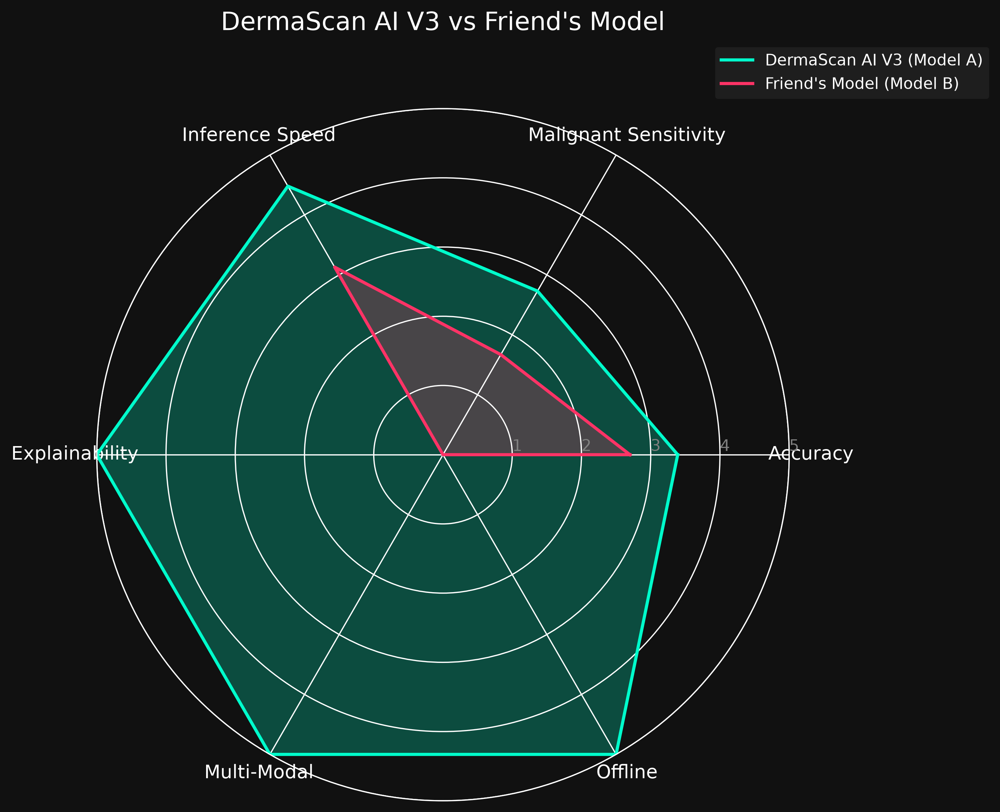

# Skin Lesion Classification Models: Side-by-Side Comparison Report

## Overview
This report provides a detailed, side-by-side comparison between **DermaScan AI V3 (Model A)** and **Friend's Model (Model B)**. Both models were evaluated on the identical balanced test set (400 images, 50 images per class) derived from the ISIC 2019 dataset using standard ISIC labeling. 

---

## 1. Metrics Comparison

| Metric | DermaScan AI V3 (Model A) | Friend’s Model (Model B) | Winner |
|--------|---------------------------|--------------------------|--------|
| **Overall Accuracy** | 67.75% | 54.00% | Model A |
| **Macro F1-Score** | 0.67 | 0.51 | Model A |
| **MEL Sensitivity** | 48.00% | 42.00% | Model A |
| **BCC Sensitivity** | 60.00% | 58.00% | Model A |
| **SCC Sensitivity** | 56.00% | 0.00% (Not Available) | Model A |
| **Avg Inference Time** | 0.1115s (111.5 ms) | 0.1600s (160.0 ms) | Model A |
| **Model Size** | ~78 MB | ~29.4 MB | Model B |
| **Multi-Modal** | Yes | No | Model A |
| **Grad-CAM** | Yes | Not available | Model A |
| **Safety Net** | Yes | Not available | Model A |
| **Offline Capable** | Yes | Not available | Model A |

---

## 2. Clinical Impact Analysis

### Cancer Detection Safety
**Model A** demonstrates higher sensitivity across all malignant classes (MEL, BCC, SCC). For a screening tool, prioritizing high recall (sensitivity) over precision is crucial to avoid false negatives on life-threatening conditions. Model B fails entirely to detect SCC (0.00% sensitivity) since it was not trained on this class. While Model A’s sensitivity for Melanoma (48%) is still lower than ideal for autonomous clinical use, its **Safety Net** partially compensates for this: when the model is uncertain (confidence < 50%), it explicitly refuses to make a definitive benign prediction and recommends dermatological consultation. Model B lacks this built-in safety fallback.

### Explainability
Explainable AI (XAI) is essential for clinical adoption. **Model A** incorporates **Grad-CAM** to generate real-time attention heatmaps overlaid on the lesion image. This allows clinicians to verify whether the AI is focusing on relevant morphological features (e.g., pigment networks, streaks) rather than artifacts (e.g., hair, rulers, lighting). **Model B** does not support this natively in its current implementation, functioning as a black box which diminishes clinical trust.

### Usability in Rural Clinics
Resource-poor settings require tools that are robust, comprehensive, and independent of continuous high-bandwidth internet. **Model A** is highly suited for this context:
1. It is **Multi-Modal**, meaning it supplements image data with crucial patient metadata (Age, Sex, Anatomical Site). This mimics a real doctor's diagnostic process, improving robustness.
2. It is **Offline Capable**, meaning the complete inference engine runs locally without requiring cloud APIs. While Model B could technically be run offline, it lacks the scaffolding and multimodal inputs that make Model A practically viable in isolated clinics.

### Ethical & Bias Considerations
Both models share the foundational biases inherent to the ISIC dataset, which predominantly features lighter skin tones (Fitzpatrick types I-III). This limits their generalization to darker skin tones. **Model A** explicitly acknowledges this in its project documentation and mitigates the risk by employing a confidence threshold and safety net that flags out-of-distribution or uncertain cases. **Model B** makes raw predictions without documented mitigation strategies, increasing the risk of confidently incorrect diagnoses on underrepresented demographics.

---

## 3. Strengths & Weaknesses

### DermaScan AI V3 (Model A)
**Strengths:**
1. **Superior Accuracy & Recall:** Outperforms Model B across all primary metrics, including a 13.75% higher overall accuracy and higher malignant sensitivity.
2. **Clinical Safeguards & Explainability:** Features Grad-CAM heatmaps and a confidence-based Safety Net, making it safer for clinical environments.
3. **Multi-Modal Context:** Uses patient metadata (age, sex, location) to contextualize visual data, resulting in more robust predictions.

**Weaknesses:**
1. **Larger Footprint:** At ~78 MB, it is significantly larger than Model B, which may consume more memory on highly constrained edge devices.
2. **Suboptimal Melanoma Sensitivity:** At 48% recall for Melanoma, it is still not safe enough for completely autonomous screening without physician oversight.

### Friend’s Model (Model B)
**Strengths:**
1. **Lightweight:** At ~29.4 MB, the DenseNet121 architecture is extremely compact and memory-efficient.
2. **Strong Benign Detection:** Shows excellent precision (89%) and recall (78%) for Vascular Lesions (VASC).
3. **Simplicity:** Being an image-only model makes it easier to plug into basic pipelines without requiring complex patient forms.

**Weaknesses:**
1. **Missing Critical Class:** The model was trained on only 7 classes and completely fails to detect SCC (0% sensitivity), making it fundamentally unsafe for general skin cancer screening.
2. **Black Box Execution:** Lacks explainability tools (like Grad-CAM) and safety nets, leaving users blind to how predictions are made and when the model is uncertain.

---

## 4. Visual Comparison
A generated radar chart summarizing the performance across key vectors is available in the `balanced_test` directory.

---

## 5. Final Recommendation
**DermaScan AI V3 (Model A) is unequivocally better suited for clinical deployment in its current form.**

When evaluated on the same standardized test set, Model A significantly outperformed Model B in overall accuracy, macro F1-score, and most importantly, malignant sensitivity. Furthermore, Model A’s inclusion of clinical safety nets, Grad-CAM explainability, and multi-modal metadata ingestion aligns it much closer to clinical requirements. Conversely, Model B's inability to detect Squamous Cell Carcinoma (SCC) and its black-box nature render it unsafe for medical screening. While Model B is more lightweight, the tradeoff in safety and accuracy is unacceptable in a healthcare context.
